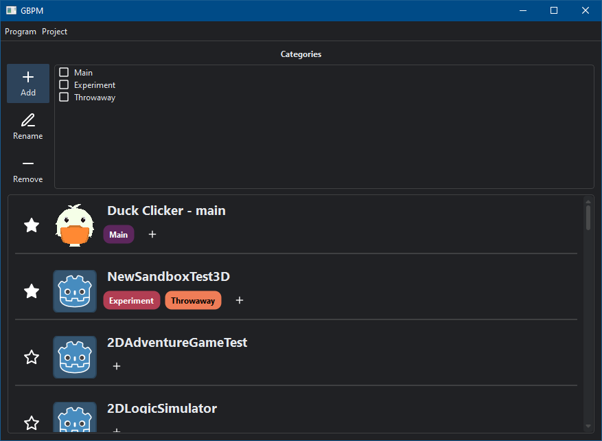

# Godot Project Manager alternative

## Overview
Didn't like the Godot project manager and didn't feel like modifying Godot code. This is a personal project. If you manage to get something out of it - that's great.

## Features 
- assign/remove a category for a simple filtering
- favourite projects to shown before other projects
- create a project from a template
- rename and remove a project
- dark mode by default

## Planned features
- options menu
- go to project directory right-click option
- multi directory support

# Configuration
Copy the `config_template.json` and paste as `config.json`.
| Key | Expected value | Example |
|-----|----------------|---------|
|`godotLocation`|Path to the Godot binary.|`"godotLocation": "D:\\SteamLibrary\\steamapps\\common\\Godot Engine\\godot.windows.opt.tools.64.exe"`|
|`projectsDir`|Path to where the Godot projects are located.|`"projectsDir": "D:\\programming\\Godot"`|
|`saveProjectsDir`|Path to where to save the generated projects.json. This will be accesed and written to frequently.|`"saveProjectsDir": "D:\\programming\\Godot-better-project-manager\\projects.json"`|
|`colorPresets`|Array of color presets. They will be chosen in a sequence for category tag coloring. By default, modified [Sweetie 16](https://lospec.com/palette-list/sweetie-16) palette is used.|`"colorPresets":[ "#5d275d", "#b13e53", "#ef7d57", "#ffcd75", "#a7f070", "#38b764", "#257179", "#29366f", "#3b5dc9", "#41a6f6", "#73eff7", "#94b0c2", "#566c86", "#333c57"]`|

# Requirements
- Python 3.9

Install the required packages via:

`pip install -r requirements.txt`

# Other licenses
- [Feather](https://github.com/feathericons/feather) - MIT